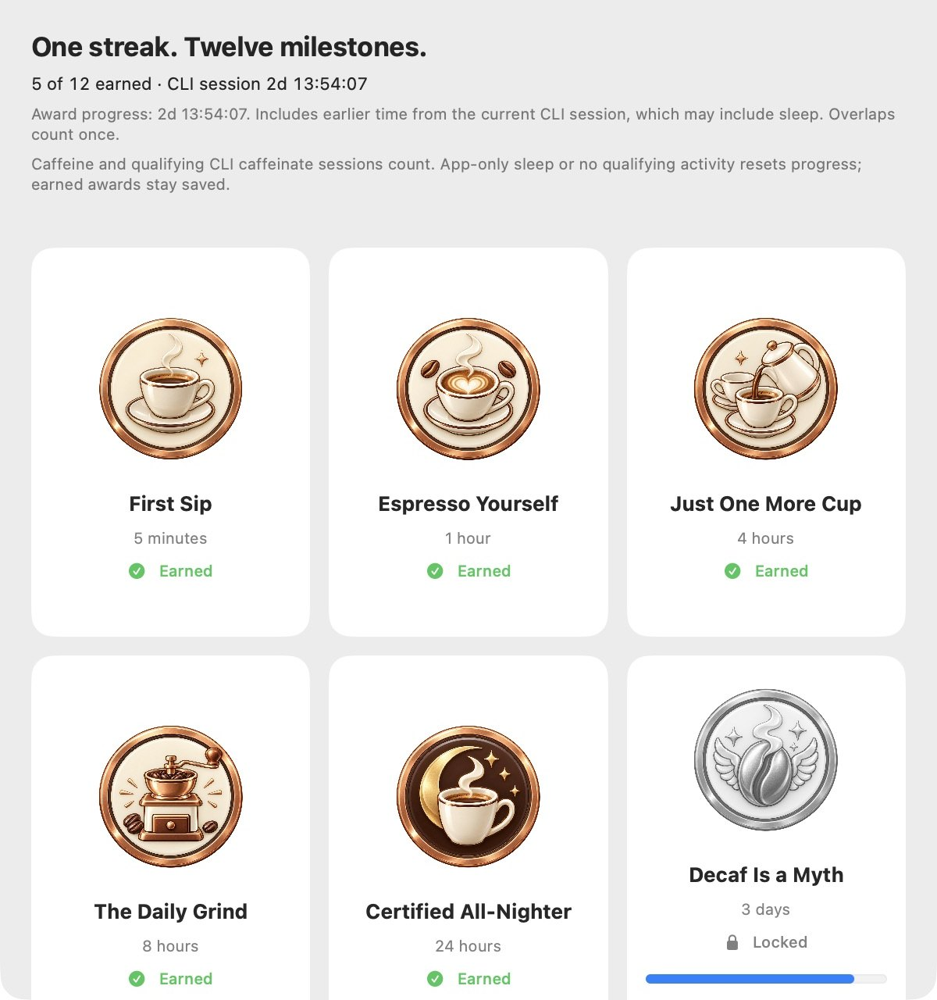
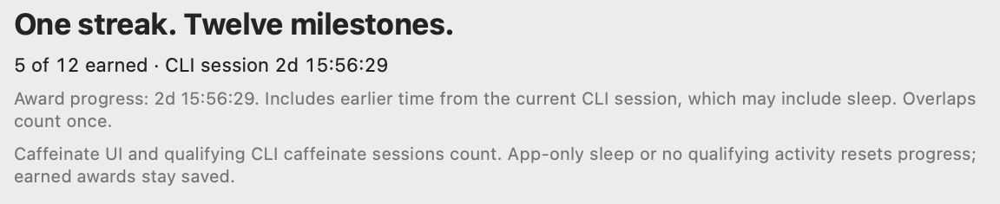
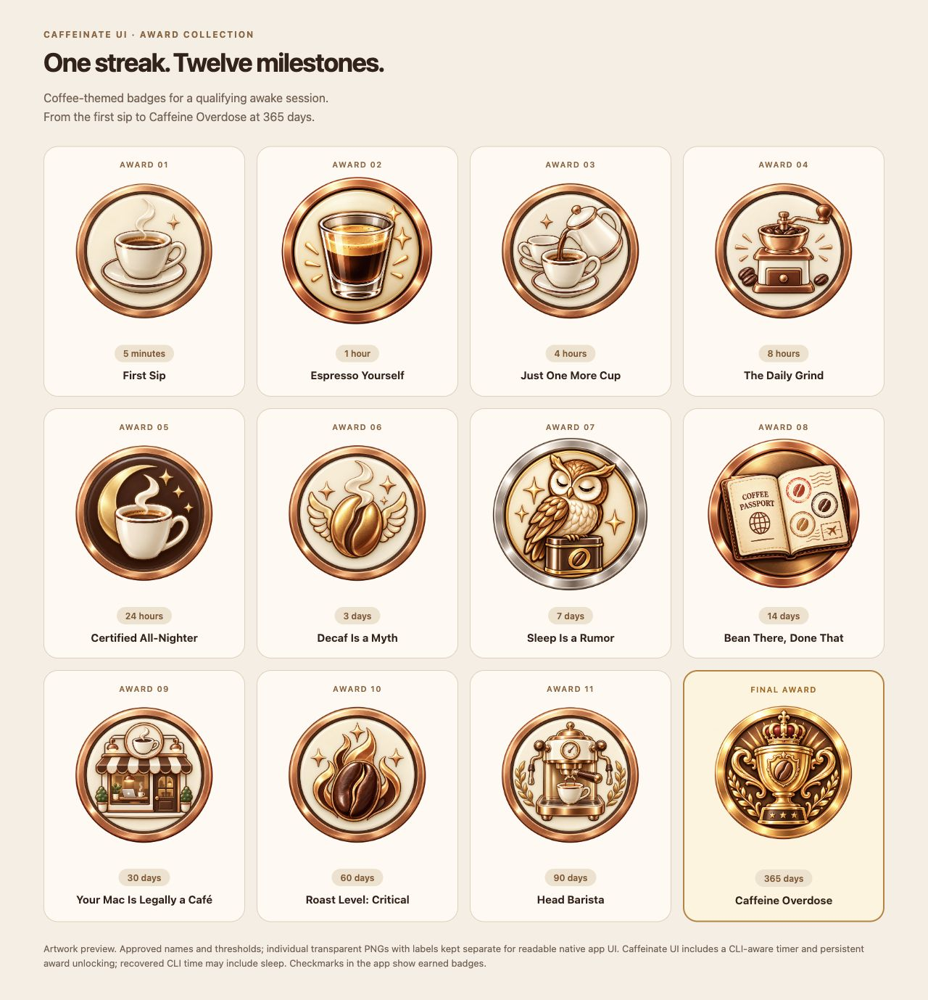

# Caffeinate UI for macOS


**Keep your Mac awake. Keep your agents running.**

Built for the agent era: Hari made Caffeinate UI for long-running local coding agents, builds and terminal workflows. It manages macOS idle-sleep assertions and shows active `caffeinate` sessions, with twelve coffee awards along the way. Caffeinate UI uses Swift, AppKit, SwiftUI and IOKit with no third-party package dependencies. Current source version: **1.7 (build 8)**.

- Control system and display idle sleep independently.
- See a session timer for app-owned and qualifying CLI assertions.
- Recover earlier time from a still-running CLI session, counting overlaps once.
- Open a resizable Awards window: locked artwork is grey, earned artwork is full colour, and earned badges persist.



Installed 1.5 app, captured on 10 October 2026. Five awards came from a qualifying CLI session of roughly 2 days 16 hours. This elapsed time may include system sleep; the screenshot is not an isolated demonstration or proof of continuous awake time. Only app content is shown. Source and installed app are now 1.7; fresh native menu screenshots are pending visual verification.

## Requirements

The app declares **macOS 13 or later**. Build with a compatible **Swift 6** toolchain from Xcode or Apple Command Line Tools, plus Git and Python 3 for scripts. The automated suite has been run on this Mac; test-framework compatibility on macOS 13 and other machines is not established. Newer Swift Testing libraries may require macOS 14 or later.

Check your toolchain with `xcode-select -p` and `swift --version`. Local bundles are ad hoc signed and verified by the scripts; this repository does not provide a notarized release or App Store distribution.

## Install from source

```sh
git clone https://github.com/harinaralasetty/caffeinate-ui.git
cd caffeinate-ui
./script/install.sh CaffeinateUI
```

This checkout builds Caffeinate UI only. The installer builds, verifies, installs into `/Applications` and opens Caffeinate UI. It needs write access to the destination and does not elevate privileges. For a user installation:

```sh
CAFFEINATE_UI_INSTALL_DIR="$HOME/Applications" ./script/install.sh CaffeinateUI
open "$HOME/Applications/Caffeinate UI.app"
```

Re-running skips byte-identical bundles. Updates preserve a ZIP and the prior bundle in `recovery/install-backups/` in the checkout, then verify the installed bytes. To roll back, quit Caffeinate UI and restore the matching backup bundle to the same install path. Backups and build output are ignored by Git.

Optional login startup uses a per-user LaunchAgent, without a KeepAlive loop:

```sh
./script/install.sh CaffeinateUI --login
./script/login_items.sh status CaffeinateUI
./script/login_items.sh disable CaffeinateUI
```

Disabling startup does not quit Caffeinate UI. When moving installations, disable the old registration before installing at the new path with `--login`. A registration check does not establish success at a future login.

## Use the menu

| Control | Behavior |
| --- | --- |
| Turn On | Starts system idle-sleep prevention; disabled while app or CLI activity is already On |
| Keep System Awake | Toggles the app's system assertion |
| Keep Display Awake | Toggles the app's display assertion independently |
| Turn Off | Releases app assertions and stops verified standalone Terminal caffeinate sessions; disabled once fully Off |
| CLI session / Awake streak | Shows current elapsed time |
| Show Awards… | Opens or raises one retained native Awards window |
| Other Sleep Assertions | Explains other active system/display assertions |

A steaming cup and On heading both mean app or qualifying CLI activity is active. A plain cup and Off heading mean neither is active. Turn Off stops standalone `/usr/bin/caffeinate` processes owned by your user and attached to an interactive shell, after rechecking executable, owner, birth time, arguments and children. Wrapped commands, `-w` job monitors, processes with children, other application-owned processes and unverified detached processes are preserved. Failures identify the affected PID; remaining qualifying activity keeps steam and On visible. Detached processes require explicit authorization for their exact PID and birth time because their original owner cannot be recovered. No shell, process group or workload is terminated, and no force kill is used. Once all qualifying activity ends, the timer resets and earned awards remain saved. Quit releases only app assertions. App choices persist and restore on launch; assertion IDs are acquired afresh. System and display toggles remain independent. Other apps may still prevent idle sleep when Caffeinate UI is Off. Lid closure, low battery, forced sleep and macOS power policy can override idle-sleep prevention. Caffeinate UI does not supervise or restart agents, prevent crashes or network outages, or guarantee uninterrupted jobs. Keeping the system or display awake can increase battery use; enable only the controls your task needs.

## Timer and awards



Caffeinate UI samples qualifying CLI assertions once per second. System idle-sleep (`-i` or default) and display idle-sleep (`-d`) count. Timed `-t` and watched-process `-w` sessions stop qualifying when their assertions expire. User-active `-u`, disk-only `-m`, and unrelated apps do not earn awards. `-s` counts only on AC power and receives no historical credit by itself because earlier AC conditions are unknown.

A currently active assertion with a macOS start timestamp and global ID can recover its earlier duration, **including possible sleep**. That earlier time counts toward awards. The app reconciles one continuous interval by taking elapsed coverage, not by adding simultaneous sessions. Persisted interval claims match both identity and start timestamp; previously observed overlaps survive relaunch while an associated assertion is still active. Repeated opens, polling and relaunches do not multiply time or duplicate earned IDs. A restarted, nonoverlapping CLI identity starts a fresh interval. Closed process history is not restored. Missing metadata falls back to time observed by the app; future dates receive no earlier credit.

App-only progress resets when no qualifying activity remains, on quit/relaunch, or system sleep. A still-running CLI session can recover its interval after relaunch or sleep. Calendar changes do not advance an already anchored interval; a detected clock discontinuity prevents a new historical anchor. Display sleep and screen locking do not reset app-only progress. Earned awards remain saved, and no unlock dates are fabricated.

| Award | Session threshold |
| --- | --- |
| First Sip | 5 minutes |
| Espresso Yourself | 1 hour |
| Just One More Cup | 4 hours |
| The Daily Grind | 8 hours |
| Certified All-Nighter | 24 hours |
| Decaf Is a Myth | 3 days |
| Sleep Is a Rumor | 7 days |
| Bean There, Done That | 14 days |
| Your Mac Is Legally a Café | 30 days |
| Roast Level: Critical | 60 days |
| Head Barista | 90 days |
| Caffeine Overdose | 365 days |

A day is 24 hours. The [badge catalog](CaffeinateUI/Resources/Badges/catalog.json) defines ordered thresholds and artwork; the [badge gallery](CaffeinateUI/Resources/Badges/README.md) shows all twelve images.



The collection above renders the actual PNG assets with separate catalog labels. Regenerate the HTML cards with `python3 script/generate_badge_preview.py`; `--check` detects catalog drift.

## Build and test

```sh
./script/build_and_run.sh CaffeinateUI --build-only
./script/test.sh
python3 script/audit_source.py
```

The build creates `"dist/Caffeinate UI.app"`. Build-only does not launch or quit apps. The full test script runs 30 Swift tests and a packaged self-test: real assertion acquisition/release, twenty ownership cycles, image decoding, simulated clocks, persistence, CLI overlap/restart, unified menu state and safe test-owned CLI termination. `./script/test.sh --no-display` runs 29 tests and skips real display assertions and the packaged display self-test. Tests use isolated defaults and never advance real award storage or terminate existing CLI processes.

See the [architecture and contribution guide](ARCHITECTURE.md) for the file map, invariants and diagnostic commands. Real system sleep, login-cycle and AC/battery switching remain manual checks; do them only when ongoing work can safely pause. Automated tests do not certify every macOS version or hardware configuration.

## Privacy and support

The app has no network client, account, telemetry service or cloud sync code. It reads local power-assertion metadata and saves app choices, earned IDs and CLI interval claims in local UserDefaults. Screenshots in this repository contain app UI only. Build/install scripts use local tools; cloning and pushing Git contact GitHub.

Maintained by [Hari Naralasetty](https://github.com/harinaralasetty). Report reproducible issues through [Caffeinate UI repository issues](https://github.com/harinaralasetty/caffeinate-ui/issues), including macOS version, build/toolchain version, relevant errors and whether app-owned or CLI activity was involved. Review screenshots/logs for private information before posting.

## Homebrew preparation

The [distribution plan](distribution/README.md) and draft cask are preparation only. A published versioned release and tested tap are still pending; Developer ID signing and notarization are recommended for public binary first launch, rather than universal own-tap requirements; no Homebrew installation command for this app is published.

The rename keeps `personal.harinaralasetty.Caffeine` as the bundle identifier and the original login-job label so existing awards and settings survive. The installer backs up and migrates this project's old `Caffeine.app` only after checking its identity, and updates an already configured login job to `Caffeinate UI.app`. Another vendor's bundle is never overwritten.
